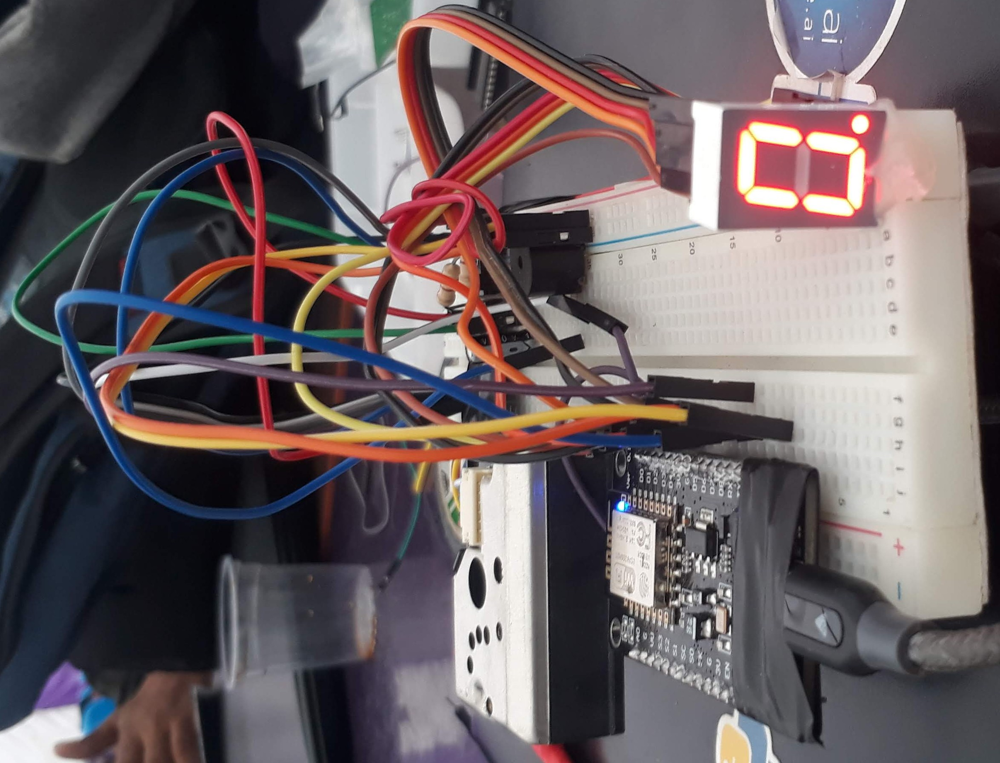
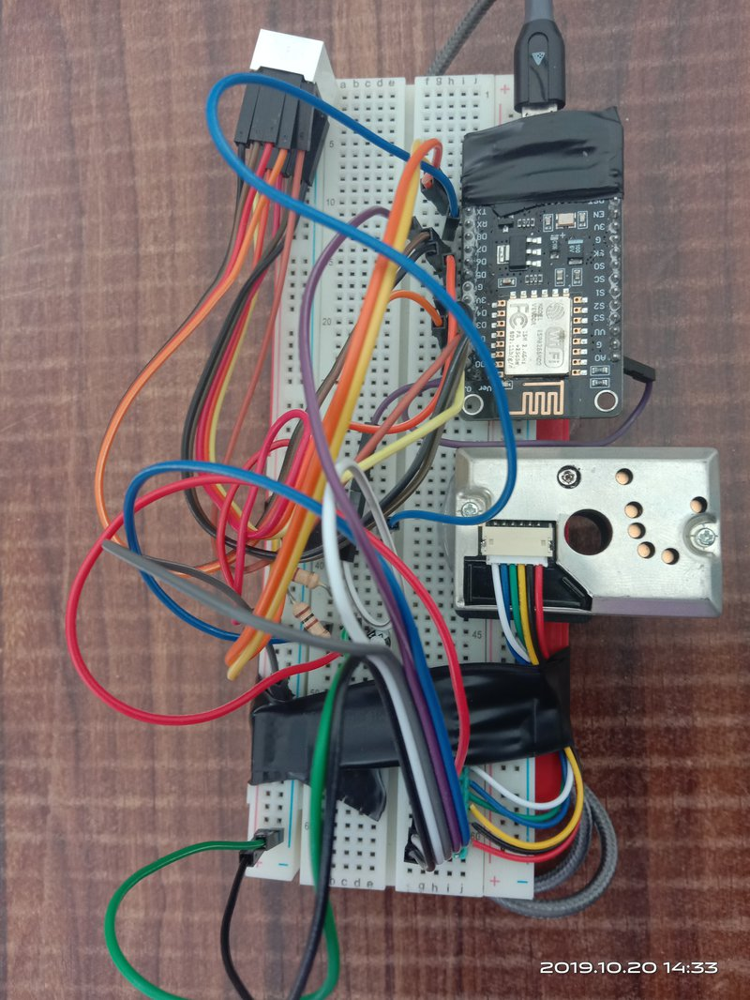

# Mobile-AQI-Device

Mobile-AQI-Device is a NODEMCU ESP32 based Air Quality Index device developed during <a href="https://2019.spaceappschallenge.org/challenges/living-our-world/surface-air-quality-mission/details"> Space Apps Challenge | 2019 </a> under Surface air quality mission.

## Images

   

   

## Components Used

1. NODEMCU ESP32
2. Dust Sensor Module - GP2Y1010AU0F
3. Seven-Segment Display
4. Piezo Buzzer
5. Bread Board
6. Powerbank
7. Polar Capacitor 220 µF
8. Resistor 150 Ω

## Working

Dust Sensor Module - GP2Y1010AU0F is used for measuring concentration of dust particles in the air. A power bank of 5v is used as a power supply that powers the Node Mcu along with other components. Input from sensor (Voltage) is taken and processed to AQI mg/m3.The code is divided in to three sections:

1.  **7-seg.h:**
    It is used to display the pollution level between 0 to 9 where 0 is the lowest pollution level and 9 is the highest.

2.  **Pollution.h:**
    This section is used to interface with sensor. The code required to get the raw value and convert it to mg/m3 is included here.

3.  **reg.h:**
    Here the regression calculation is done where the AQI of next hour is calculated using the reference data of previous hours.

4.  **Mobile_AQI.ino:**
    This is the main file to execute all the process. The headers are imported and their respective functions are called. The main processing sequence starts from this file. The Current AQI value is displayed on the web browser if the ip of device is used as url. Both the device and web browser should be in same network.

As we can see in the video linked below, the red dot at the end of display signifies the current pollution level and the level without the red dot denotes the predicted pollution level after an hour. The index value is updated each second. The data is not linear but linear regression model is used just for the proof of concept. **Arduino Code** folder contains same but optimized code for Arduino.

## Watch The Video

  

